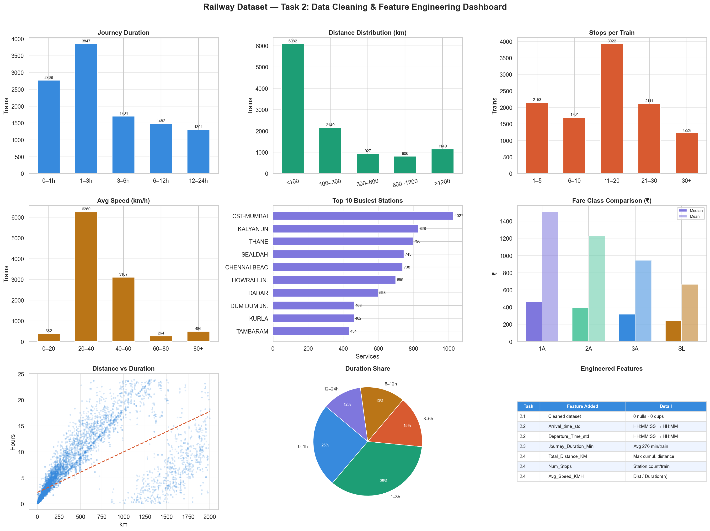

# 🚆 Indian Railway Journey Time Prediction System

> An end-to-end Data Science project analyzing **186,074 records** across **11,113 Indian trains** — from raw data exploration to a Machine Learning prediction system for journey duration.

---

## 📌 Project Overview

This project performs a full data science lifecycle on the Indian Railways dataset, covering data overview, cleaning, feature engineering, exploratory analysis, statistical inference, and predictive modeling using **Linear Regression**. The final system predicts a train's journey time based on route distance, number of stops, average halt time, and fare class.

---

## 🗂️ Dataset Information

| Property | Value |
|---|---|
| Total Records | 186,074 rows |
| Total Columns | 12 |
| Unique Trains | 11,113 |
| Missing Values | 0 |
| Duplicate Rows | 0 |

**Key Columns:** `Train_No`, `Station_Name`, `Station_Code`, `Arrival_time`, `Departure_Time`, `Distance`, `SN`, `1A`, `2A`, `3A`, `SL`

---

## 🏗️ Project Structure

```
railway-journey-prediction/
│
├── Railway_Dataset_project.ipynb   # Main Jupyter Notebook (all levels)
├── Dataset1.csv                    # Raw dataset (not included — see below)
├── README.md
│
├── outputs/                        # Generated visualizations
│   ├── task1_1_datatypes.png
│   ├── task1_2_routes.png
│   ├── task1_3_stats.png
│   ├── task1_4_quality.png
│   ├── eda_plots.png
│   ├── correlation_heatmap.png
│   ├── actual_vs_predicted.png
│   ├── bar_actual_vs_predicted.png
│   └── feature_importance.png
```

---

## 📚 Project Levels

### Level 1 — Data Overview
- Summary of total records, columns, and data types
- Train-wise route table (start station → end station)
- Descriptive statistics for distance and number of stops
- Data quality check: null values, duplicates, hidden inconsistencies
- **Key finding:** Dataset is clean with 0 missing values and 0 duplicates across all 186,074 rows

### Level 2 — Data Cleaning & Feature Engineering
- Handled missing values and removed duplicate records
- Standardized `Arrival_time` and `Departure_Time` from `HH:MM:SS` to `HH:MM` format
- Calculated total journey duration per train (with overnight journey handling)
- Engineered features: `total_distance_km`, `num_stops`, `avg_halt_min`, `avg_fare_SL`

### Level 3 — Exploratory Data Analysis (EDA)
- Distribution plots for journey time and distance
- Scatter plots: Distance vs Journey Time, Stops vs Journey Time
- Feature Correlation Heatmap
- Top 15 longest routes by distance

### Level 4 — Statistical Analysis
- Correlation analysis between engineered features and the target variable
- Identification of key predictors for journey time

### Level 5 — Machine Learning (Linear Regression)
- Built a journey-level feature matrix from raw station-level data
- 80/20 train-test split (8,882 train / 2,221 test)
- Trained Linear Regression model with StandardScaler normalization
- **Model Equation:** `duration = 66.63 + 0.28×distance + 6.77×stops`

| Metric | Value |
|---|---|
| MAE | 151.5 minutes |
| RMSE | 235.6 minutes |
| R² Score | 44.4% |

### Level 6 — Final Prediction System
- End-to-end pipeline: raw CSV → feature engineering → trained model → predictions
- 4-feature model: `total_distance_km`, `num_stops`, `avg_halt_min`, `avg_fare_SL`
- Full visualization suite: Actual vs Predicted scatter, residuals histogram, bar comparison, and feature importance chart

---

## 📊 Model Results

```
================================================
         MODEL PERFORMANCE REPORT
================================================
  Mean Absolute Error  (MAE)  : 151.52 min
  Root Mean Sq. Error  (RMSE) : 235.60 min
  R² Score  (Test)            :  0.4440
  R² Score  (Train)           :  0.4471
================================================
Model explains 44.4% of variance in journey time.
Average prediction error: 151.5 minutes.
```

> **Note on R² (~44%):** The model intentionally uses only 4 interpretable features. Real-world journey time depends on train type, delays, average speed, and seasonal factors — all of which would increase R² significantly if included.

---

## Project Output


## 🛠️ Tech Stack

| Tool | Purpose |
|---|---|
| Python 3.x | Core language |
| Pandas | Data manipulation |
| NumPy | Numerical operations |
| Matplotlib | Data visualization |
| Seaborn | Statistical plots |
| Scikit-learn | Machine Learning (LinearRegression, StandardScaler, train_test_split) |
| Jupyter Notebook | Development environment |

---

## ⚙️ Installation & Usage

### 1. Clone the repository
```bash
git clone https://github.com/your-username/railway-journey-prediction.git
cd railway-journey-prediction
```

### 2. Install dependencies
```bash
pip install pandas numpy matplotlib seaborn scikit-learn jupyter
```

### 3. Add the dataset
Place your `Dataset1.csv` file in the root directory. The dataset should contain the columns listed above.

### 4. Run the notebook
```bash
jupyter notebook Railway_Dataset_project.ipynb
```

Run all cells from top to bottom. Each level is clearly marked and self-contained.

---

## 📈 Key Insights

- The longest Indian train route in the dataset spans **4,260 km**
- Average journey duration is approximately **276 minutes (~4.6 hours)**
- Trains stop at anywhere between **2 and 118 stations**
- Median stops per train: **15**, with a mean of **~17**
- `num_stops` is the strongest predictor of journey time (highest coefficient magnitude)

---

## 🔮 Future Improvements

- Add train category (Express, Superfast, Passenger) as a feature
- Include average speed estimation for better accuracy
- Try non-linear models: Random Forest, Gradient Boosting (XGBoost)
- Build an interactive prediction dashboard using Streamlit or Gradio
- Incorporate real-time delay data via Indian Railways API

---

## 👤 Author

**[Sovesh Singh]**
Data Science Intern — Sysslan IT Solutions

---

## 📄 License

This project is licensed under the MIT License. See the [LICENSE](LICENSE) file for details.

---

> *Built as part of a Data Science internship project. All analysis performed on publicly available Indian Railways schedule data.*
